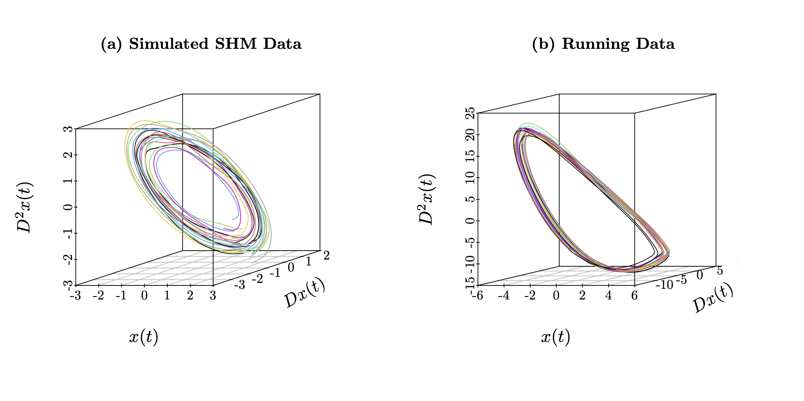

```{r setup, include=FALSE}
knitr::opts_chunk$set(echo = TRUE)
```

<!--  -->

```{r, fig.asp=0.5, echo = FALSE}

```

---

# Welcome

This repository contains code and data for the manuscript __*'An Understanding of Principal Differential Analysis'*__ by [Edward Gunning](https://edwardgunning.github.io/) and [Giles Hooker](http://www.gileshooker.com/). (*add ArxIv link to paper*)

---

# Repository Structure

* 📂 [**code**](code/)
  * 📄 contains R scripts with analysis and functions for the paper
  * 📂 [**paper-figures**](code/paper-figures/) R scripts to generate figures from the paper

---

# References

* Ramsay, J. O. (1996). Principal Differential Analysis: Data Reduction by Differential Operators. Journal of the Royal Statistical Society. Series B (Methodological), 58(3), 495–508.

---

# Computing Information

```{r}
R.version
sessionInfo()
```


