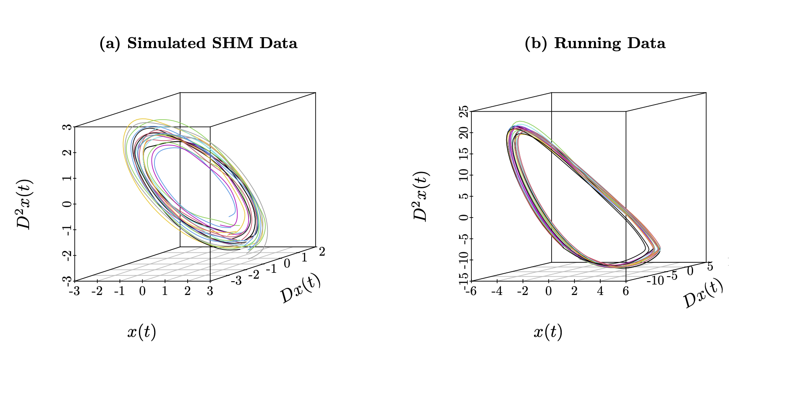

Code for the Manuscript: ‘An Understanding of Principal Differential
Analysis’
================

<!--  -->



------------------------------------------------------------------------

# Welcome

This repository contains code and data for the manuscript ***‘An
Understanding of Principal Differential Analysis’*** by [Edward
Gunning](https://edwardgunning.github.io/) and [Giles
Hooker](http://www.gileshooker.com/). (*add ArxIv link to paper*)

------------------------------------------------------------------------

# Repository Structure

- 📂 [**code**](code/)
  - 📄 contains R scripts with analysis and functions for the paper –
    the simple harmonic motion (SHM) model, the van der Pol (VdP) model
    and the real data analysis of the runner’s centre of mass (COM).
  - 📂 [**paper-figures**](code/paper-figures/) R scripts to generate
    figures from the paper including the simple harmonic motion (SHM)
    model, the van der Pol (VdP) model and the real data analysis of the
    runner’s centre of mass (COM).
- 📂 [**data**](data/)
  - data for the analysis of running kinematics. We are very grateful to
    Prof. Kieran Moran for providing this dataset.

------------------------------------------------------------------------

# References

- Ramsay, J. O. (1996). Principal Differential Analysis: Data Reduction
  by Differential Operators. Journal of the Royal Statistical Society.
  Series B (Methodological), 58(3), 495–508.

------------------------------------------------------------------------

# Computing Information

``` r
R.version
```

    ##                _                           
    ## platform       x86_64-apple-darwin17.0     
    ## arch           x86_64                      
    ## os             darwin17.0                  
    ## system         x86_64, darwin17.0          
    ## status                                     
    ## major          4                           
    ## minor          1.2                         
    ## year           2021                        
    ## month          11                          
    ## day            01                          
    ## svn rev        81115                       
    ## language       R                           
    ## version.string R version 4.1.2 (2021-11-01)
    ## nickname       Bird Hippie

``` r
sessionInfo()
```

    ## R version 4.1.2 (2021-11-01)
    ## Platform: x86_64-apple-darwin17.0 (64-bit)
    ## Running under: macOS Big Sur 10.16
    ## 
    ## Matrix products: default
    ## BLAS:   /Library/Frameworks/R.framework/Versions/4.1/Resources/lib/libRblas.0.dylib
    ## LAPACK: /Library/Frameworks/R.framework/Versions/4.1/Resources/lib/libRlapack.dylib
    ## 
    ## locale:
    ## [1] en_IE.UTF-8/en_IE.UTF-8/en_IE.UTF-8/C/en_IE.UTF-8/en_IE.UTF-8
    ## 
    ## attached base packages:
    ## [1] stats     graphics  grDevices utils     datasets  methods   base     
    ## 
    ## loaded via a namespace (and not attached):
    ##  [1] compiler_4.1.2  fastmap_1.1.0   cli_3.6.1       tools_4.1.2    
    ##  [5] htmltools_0.5.5 rstudioapi_0.13 yaml_2.3.5      rmarkdown_2.27 
    ##  [9] highr_0.11      knitr_1.47      xfun_0.44       digest_0.6.29  
    ## [13] rlang_1.1.1     png_0.1-7       evaluate_0.15

``` r
packageVersion(pkg = "fda")
```

    ## [1] '5.5.1'

``` r
packageVersion(pkg = "deSolve")
```

    ## [1] '1.30'
